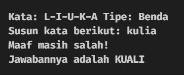

# Mini Trivia Game (CLI)

Mini Trivia Game. Scrambled Word Stacking (Command Line Interface)

# Preview:

**Lost =**



**Win =**


**Wrong Guess =**


# Depedencies

1. Python 3
2. Python Library: `requests`

# Setup & Installation

## Python

```
pip install mcpi
python source/main.py
```
